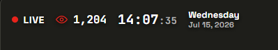

# YT Live Monitor

A lightweight browser overlay that shows your YouTube live stream's viewer count, a live/offline indicator, and the current time and date. Built for OBS (or any streaming software with a Browser Source), and designed to run entirely from local files on your own computer.

No backend, no account, no data collection. Your YouTube API key lives only in a `config.js` file on your own computer and is used to talk directly to Google's API.

  

## Features

- Live viewer count, pulled from the YouTube Data API
- Live/offline indicator
- Clock and date, each toggleable independently
- Five visual styles: Minimal, Glass panel, Solid panel, Outline, Bordered (with divider lines)
- Custom accent and background colors
- Four corner positions
- Auto-detect mode: point it at your channel and it finds whichever video is currently live, so you never have to update a video ID between streams
- Live preview while configuring, before you ever touch OBS
- Runs entirely client-side — nothing is sent anywhere except directly to YouTube's API

## How it works

This project is two files:

- **`configurator.html`** — a setup page with a live preview. Open it in any normal browser tab, fill in your API key and pick a look, and click **Download config.js**. This is where all your configuration happens — you never need to interact with settings from inside OBS.
- **`overlay.html`** — the actual overlay. It's what you point OBS's Browser Source at. It reads whatever's in `config.js` and renders accordingly. It has no setup screen of its own.

They're connected by a single generated file, **`config.js`**, which must sit in the same folder as `overlay.html`.

## Getting started

1. **Get a YouTube Data API key**
   - Go to the [Google Cloud Console credentials page](https://console.cloud.google.com/apis/credentials)
   - Create a project (or pick an existing one)
   - Enable "YouTube Data API v3" under [APIs & Services](https://console.cloud.google.com/apis/library)
   - Create an API key, and when asked what data you're accessing, choose **Public data** (this is public viewer-count info, no OAuth needed)
   - Optional but recommended: restrict the key to "YouTube Data API v3" under API restrictions, so it can't be used for anything else if it ever leaks

2. **Find your video ID or channel**
   - Video ID mode: the string after `watch?v=` in your stream's URL — simplest if you always stream to the same persistent URL
   - Channel mode: paste your `@handle`, full channel URL, or raw `UC...` channel ID — this auto-detects whichever video is currently live, useful if every stream gets a new video ID

3. **Open `configurator.html`** locally in any browser (just double-click it). Fill in the fields, watch the live preview update, and click **Download config.js**.

4. **Move the downloaded `config.js`** into the same folder as `overlay.html`.

5. **In OBS**: add a Browser Source pointed at `overlay.html` using its local file path, with a transparent background. Resize/reposition the source however you like.

### Changing settings later

Reopen `configurator.html`, adjust anything, and click **Download config.js** again — it downloads a fresh copy. Overwrite the old `config.js` with it, and OBS will pick up the change next time that source reloads.

## Why two files instead of one?

`file://` pages have flaky, browser-dependent local storage behavior — some browsers won't reliably remember settings between opens if everything lives in one page with an in-page setup screen. Writing settings to a real file on disk (`config.js`) sidesteps that entirely: it's just there, every time, until you replace it.

## This runs locally only — not on GitHub Pages

This repo is open source so anyone can read, fork, or self-review the code, but the app itself is meant to be **downloaded and run locally**, not hosted on GitHub Pages. Reason: `config.js` is generated on your own computer and never leaves it. There's no server to upload it to, and committing it into a public repo would publish your API key to the internet. Hosting `overlay.html` on Pages wouldn't work anyway, since there'd be no `config.js` sitting next to it for it to read. Clone or download the repo, and run both files straight from your local folder.

## API quota

The YouTube Data API's free tier gives you 10,000 quota units/day. This tool's default polling stays well under that:

- Video ID mode: ~2,880 units/day (1 unit every 30 seconds)
- Channel auto-detect mode: ~8,600 units/day (cheap 1-unit check every 30 seconds, plus a pricier 100-unit channel lookup every 10 minutes)

## Privacy and security

- Your API key lives only in the `config.js` file on your own computer — nothing is sent to any server operated by this project (there isn't one)
- Requests go directly from your browser to `googleapis.com`
- Don't upload or share `config.js` anywhere — anyone with it could use your API quota
- Restricting your API key (step 1 above) limits the damage if it's ever exposed

## License

MIT — see [LICENSE](LICENSE).
